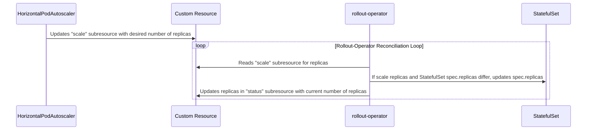
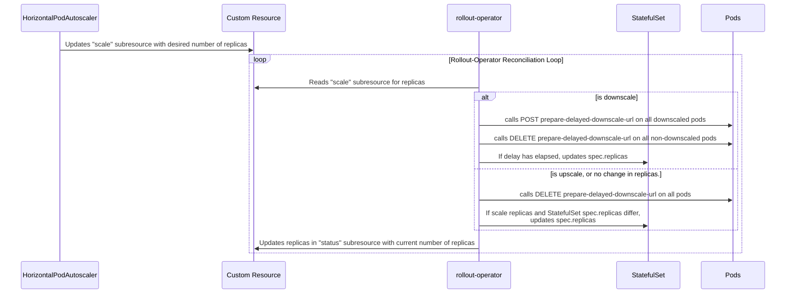

# Diagram of how rollout-operator performs scaling based on custom resource.

Scaling based on reference resource, without delayed downscale:

Scaling based on reference resource, with delayed downscale:

